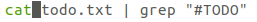
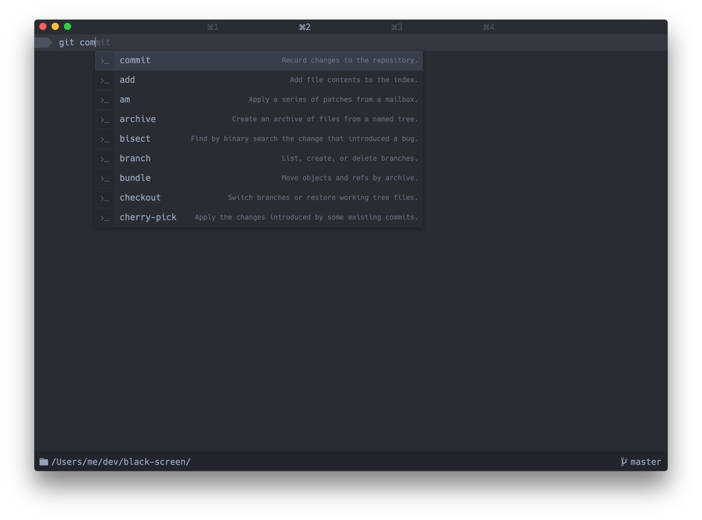
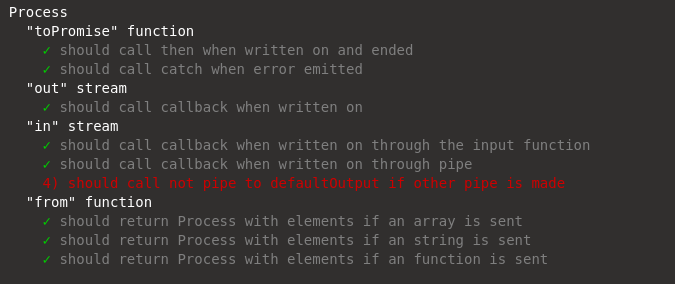

<!--
Regex:
[^(]#[A-Z]+

#CHECKLIST

- [ ] Usos possíveis do programa
- [ ] Requisitos para instalar
- [ ] Publico alvo, exemplos
- [ ] Casos de uso
- [ ] Gant
- [ ] Screenshots to prototipo

---

O relatório final deve ter no máximo 10.000 palavras


Loose text:

This project's scope also includes the reimplementation of commonly used commands in the command-line's native language (Javascript) to make the output a better graphical visualization of the results, and to allow the usage of said commands in any platform. Planned features also include syntax highlighting and autocomplete.

Th have been some attempts to modernize the shell I came across while researching,

It's an event driven language (i.e. handles asynchronicity through events and callbacks)
-->

<!-- untoc -->
# Table of Contents

<!-- toc orderedList:0 -->


<!-- tocstop -->

<p style="page-break-after: always"></p>

# 1. Project Statement

For many years the concept of a command-line has not really changed, and has stayed not only intimidating for new users but also very limited in the way it can display information. This was fine when the totality of the interaction with the system was through the terminal but no longer makes sense given the current graphical capabilities of computers.

The goal of this project is to make possible new forms of interaction by creating a programmable, user-friendly command-line capable of working in multiple platforms, able to display images and documents in an easy to understand manner with a commands history and autocomplete.

Adding programmability in the form of an extended version of the JavaScript syntax and toolkit to include different methods for calling functions, pipes and redirections, and allowing usage of internal system commands and commands specific to this command-line interchangeably.


# 2. Research
<!--
What research has been done and what are the outputs?, This concerns background research on the topic itself, as well as any research on the data analytics that you plan to perform and the technologies that you wish to use. Use the following headlines to fill in your information.
-->

## A. Background Research
<!-- Porquê do projeto -->

While researching for this topic I started by searching for similar projects, I came across several projects but none was exactly what I had in mind.

After this I did research into technologies that could be used for such a project. This led me to decide upon the programming language and a framework and several libraries that would be good for this project.

#REVIEW
<!--

What is the difference between a series and parallel circuit?
When does a plant grow the most, during the day or night?
Where is the focal point of a lens?
How does a java applet work?
Does a truss make a bridge stronger?
Why are moths attracted to light?
Which cleaning products kill the most bacteria?

keywords: terminal,
-->

<!-- pagebreak -->

## B. Alternative Existing Solutions to Your Problem

### Bash

The Bash Shell (or Bourne Again Shell) is the default shell for all Unix systems. It allows both for the execution of single commands and the construction of scripts and it has a command history and no graphical capabilities other than syntax colouring.

``` bash
echo Hello World
```
*Single command*

``` bash
while [  $COUNTER -lt 10 ]; do
	echo The counter is $COUNTER
	let COUNTER=COUNTER+1
done
```
*While loop*

This shell is the baseline for any modern shell language.

<!-- pagebreak -->
### ZShell

The ZShell is an alternative to Bash, that will extending upon the syntax of Bash it adds an extremely configurable history and highlighting. Code for this language is for the most part interchangeable with bash.


### PowerShell

PowerShell is a shell language with a very large library of functions for automating parts of the operating system. While focused on automation it also has some UI features like syntax highlighting and IntelliSense tab completion. One very interesting feature of the language is the ability of doing pipes of objects and not just strings which opens a lot of doors with its scripting.

``` powershell
Write-Host Hello World
```
*Single Command*

``` powershell
while($val -lt 10) {
	Write-Host The counter is $val
	$val++
}
```
*While loop*

### Fish Shell

The Fish Shell is a shell language that adds an advanced autocomplete, history and highlighting. It uses a language with similarities with python for its automation.

``` fish
echo Hello World
```
*Single Command*

``` fish
while $COUNTER > 10;
	echo The counter is $COUNTER
	set COUNTER COUNTER+1
end
```
*While loop*

Its highlighting displays in grey a guess of what comes after given the command history, making often used commands every quick to use.


*Example*

<!-- pagebreak -->
### Termkit

The idea for this project came from the now defunct project TermKit. It had as objective to create a graphical, user friendly interface for the traditional Unix command-line as well as expanding the capabilities of some of the commands. This project came to a halt when it’s creator hit a blocker with WebKit, the engine he was using.

This project focused on getting an environment for the commands and as such did not implement a programming language or any scripting capabilities. It also was not capable of rendering interactive commands.


*TermKit example*

[#SOURCE of Image](https://github.com/unconed/TermKit/raw/master/Mockups/Shot-0.3.png)

### Blackscreen

While researching I discovered a project similar to what I intended using the Electron API. It allows the execution of commands in bash  and makes use of autocomplete, highlighting and different rendering for some of the commands. However it still makes use of original commands as such it is limited in what it is capable of doing in regards to bettering their output. This is fine given that this is not their main objective, that being to create an IDE (Integrated development environment) for bash.



<!-- pagebreak -->
## C. Technologies Researched

### JavaScript

For the shell language I decided to use JavaScript since it's one of my favourite languages, there are already a lot of projects that would help me extend its syntax and its functional and loosely typed nature is well suited to use as a shell language.

It is possible to extend the JavaScript syntax by extending or adding on to a library to break the code down into a standard format syntax tree and using another library to convert the syntax tree back into code. This might add some overhead on the code execution but it is faster than creating a language from scratch and allows for quick changes to the syntax.

### NodeJS

A server-side implementation of JavaScript built using Google's V8 engine which is the JavaScript engine for the Chrome Browser. NodeJS and NPM, its package manager, are used by several companies and projects.

I think it is ideal for my project because it has good APIs for connecting to the operating system, is compatible with multiple operating systems and allows the creation of programmable, self contained interpreters for its self. Using this language no extra work is necessary to sandbox the interpreter. This is also a language that I have experience with from previous projects.
[#Reference - VM Sandbox](https://nodejs.org/api/vm.html)

### AcornJS

AcornJS is a Javascript library/program that breaks down Javascript into a standard format syntax tree. It is used by many code transpilers and autocompletes and can be modified using an extension API, however this API is meant for someone with deep understanding of its internal code and is not well documented. #REVIEW

### SweetJS

SweetJS is a NodeJS library that allows for the creation of scripts to extend the JavaScript syntax taking care of the breakdown and regeneration of the code. Having this in a single API makes it the simplest solution I came across for the problem of customising JavaScript. However, since it has not been designed for dynamic transpiling of individual lines of code, it might be a bit slow. This is acceptable since the console is designed for human interaction this will probably not be noticeable.

It's worth noting that SweetJS has undergone a complete rewrite recently so, at least initially, if I am to use it I will use the older version of it as features like the persistent loading of syntax scripts and syntax for adding operators have yet to be readded and are needed for the project. #REVIEW

### Electron

Electron is a library for NodeJS that allows the creation of desktop apps using HTML, CSS and JavaScript. The use of HTML and CSS for the styling of the app is helpful due to previous experience using those technologies, and to all the CSS frameworks available as well as it being a commonly used and very well documented language.

#REVIEW

### Mocha

Mocha is a simple and fast testing framework for NodeJS, that allows for unit and integration testing. It splits the tests by their components using `describe` blocks and delineates tests using `it` blocks.

### HighlandJS

HighlandJS is a Javascript library that adds a new kind of stream. This kind of stream is compatible with the ones in the standard NodeJS libraries and allow for the processing of the data passing through them using the standard functional toolkit functions like map, as well as others specific to it.

It is not as complete as some other stream libraries out there however its simplicity and built-in compatibility with NodeJS made it ideal for this project.

### AngularJS and Angular 2

AngularJS and Angular 2 are popular frameworks for the development of single page applications in JavaScript. They have features like two way binding (linking a part of the page to a JavaScript object) and html templating that make them good choice for this project.


## D. Resultant Findings and Requirements
<!-- usescases, technologies chosen -->
As a result of my research I have come to decide on the technologies to use on this project SweetJS over AcornJS due to how complicated learning the internals of Acorn proved to be.
I also have decided to use Angular 1 over Angular 2 since there is more in the way of extensions made for it at the moment and I feel it has a simpler syntax and install process.

The requirements for the project are
#TODO

## E. Bibliography

# 3. Description of Solution
<!-- possiveis usos -->
# 4. Approach and Development

# 5. Design

## A. Technical Architecture Diagram

```{puml}
package interpreter {
	class Process {
		stdin: Highland
		stdout: stream.Readable

		readonly: boolean
		_defaultOutput: Stream

		config(config): void
		input(value: any): void
		pipe(process: Process): Process

		toPromise(): Promise

		{static} pipeline(...args: any): Process
		{static} from(source: any, config: Object): Process
	}

	class Interpreter {
		stdout: Highland
		status: StateMachine
		context: context

		runCode(code: string): Object
	}

	class StateMachine {

	}

	Interpreter -- context
	context --* Process
}
```

## B. Other Design Documents

### Syntax
<!-- usecase, sequence -->
The following are some examples for the planned of lines of code before and after the SweetJs scripts alter them.

_**These are subject to changes.**_

#### Basic Example

**Input code**

``` javascript
ls -r ./;
```

**Executed code**

``` javascript
ls('-r','./');
```

#### Example with variables

**Input code**

``` javascript
ls -r ${path};
```

**Executed code**

``` javascript
ls('-r', path);
```

#### Simple Pipe

**Input code**

``` javascript
cat() | ls();
```

**Executed code**

``` javascript
_.pipeline(cat(), ls());
```

### Commands

#### cat

Plans for the cat command include adding the ability to display images, rendering code with features such as highlighting and line numbers and opening files of types such as XML and JSON with line folding.

#### ls

For ls the objective is to firstly add previews or icons for the file type, depending on what is available, next to the file names listed. Planned is also to have the files in the list be links allowing that #TODO
# 6. Prototyping and Development

# 7. Testing

## A. Automated Testing

Automated testing will be done through the MochaJS library with tests written for all different files and components. Testing files are identified by the .spec.js file extension and are written with the formats:

	{Component} should {auction} when {trigger}

for expected conditions

	{Component} should {auction} if {trigger}

for potential conditions



## B. Manual Testing

For manual testing I will provide the software to testers for both learning the viability of my design decisions and for testing of the software proper.

# 8. Issues and Risks

# 9. Plan and Future Work

# 10. Conclusion
