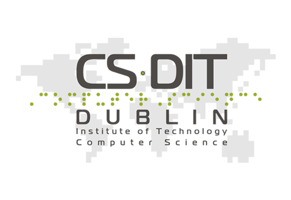
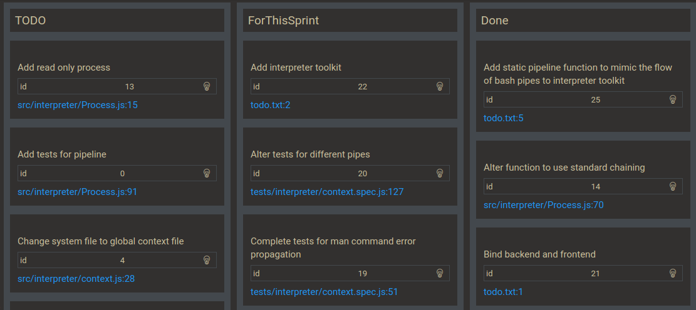
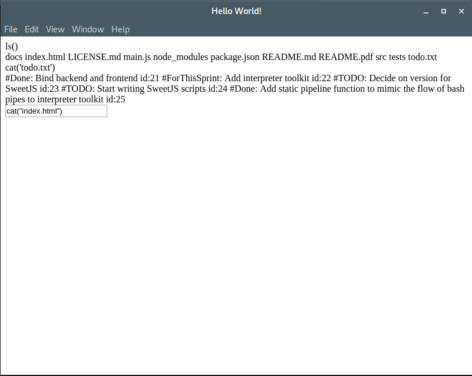

<!--
Regex:
[^(]#[A-Z]+


- [ ] Usos possíveis do programa
- [ ] Requisitos para instalar
- [ ] Publico alvo, exemplos
- [ ] Casos de uso
- [ ] Gant
- [X] Screenshots to prototipo


4:30 #Lembrar
---

O relatório final deve ter no máximo 10.000 palavras


Loose text:

This project's scope also includes the reimplementation of commonly used commands in the command-line's native language (Javascript) to make the output a better graphical visualization of the results, and to allow the usage of said commands in any platform. Planned features also include syntax highlighting and autocomplete.

Th have been some attempts to modernize the shell I came across while researching,

It's an event driven language (i.e. handles asynchronicity through events and callbacks)
-->
<div style="margin-bottom: 200px; margin-top: -70px; margin-left: -20px;">

</div>

<table style="display: table;width:100%; text-align: center;">
<tbody>
<tr>
<td colspan="3"><h1>Eel Terminal: Javascript Graphical Shell</h1></td>
</tr>
<tr>
<td>
<b>Student Name</b><br/>
André Barata
</td>
<td>
<b>Student ID</b><br/>
c13765235
</td>
<td>
<b>Supervisor Name</b><br/>
Diana Carvalho e Ferreira
</td>
</tr>
</tbody>
</table>

<p style="page-break-after: always;"></p>


<!-- untoc -->
# Table of Contents

<!-- toc orderedList:0 -->

- [1. Project Statement](#1-project-statement)
- [2. Research](#2-research)
	- [A. Background Research](#a-background-research)
	- [B. Alternative Existing Solutions to Your Problem](#b-alternative-existing-solutions-to-your-problem)
		- [Bash](#bash)
		- [ZShell](#zshell)
		- [PowerShell](#powershell)
		- [Fish Shell](#fish-shell)
		- [Termkit](#termkit)
		- [Blackscreen](#blackscreen)
	- [C. Technologies Researched](#c-technologies-researched)
		- [JavaScript](#javascript)
		- [NodeJS](#nodejs)
		- [AcornJS](#acornjs)
		- [SweetJS](#sweetjs)
		- [Electron](#electron)
		- [MochaJS](#mochajs)
		- [HighlandJS](#highlandjs)
		- [AngularJS and Angular 2](#angularjs-and-angular-2)
	- [D. Resultant Findings and Requirements](#d-resultant-findings-and-requirements)
- [3. Description of Solution](#3-description-of-solution)
- [4. Approach and Methodology](#4-approach-and-methodology)
- [5. Design](#5-design)
	- [A. Technical Architecture Diagram](#a-technical-architecture-diagram)
	- [B. Other Design Documents](#b-other-design-documents)
	- [B. Syntax](#b-syntax)
		- [Basic Example](#basic-example)
		- [Example with variables](#example-with-variables)
		- [Simple Pipe](#simple-pipe)
	- [D. Commands](#d-commands)
		- [cat](#cat)
		- [ls](#ls)
		- [cp and rm](#cp-and-rm)
- [6. Prototyping and Development](#6-prototyping-and-development)
- [7. Testing](#7-testing)
	- [A. Automated Testing](#a-automated-testing)
	- [B. Human Testing](#b-human-testing)
- [8. Issues and Risks](#8-issues-and-risks)
	- [A. Backup plans](#a-backup-plans)
		- [SweetJS](#sweetjs-1)
		- [Autocompletion](#autocompletion)
		- [Rendering API](#rendering-api)
		- [ANSI Interpreting](#ansi-interpreting)
		- [Replacement of functionality of native commands](#replacement-of-functionality-of-native-commands)
- [9. Plan and Future Work](#9-plan-and-future-work)
	- [A. Implemented Features](#a-implemented-features)
	- [B. Features to be Implemented](#b-features-to-be-implemented)
- [10. Conclusion](#10-conclusion)
- [11. Bibliography](#11-bibliography)

<!-- tocstop -->

<p style="page-break-after: always;"></p>

# 1. Project Statement

For many years the concept of a command-line has not really changed and has stayed not only intimidating for new users but also very limited in the way it can display information. This was fine when the totality of the interaction with the system was through the terminal but no longer makes sense given the current graphical capabilities of computers.

The goal of this project is to make possible new forms of interaction for by creating a programmable, user-friendly command-line capable of working on multiple platforms, able to display images and documents in an easy to understand manner with a commands history and autocomplete.

Adding programmability in the form of an extended version of the JavaScript syntax and toolkit to include different methods for calling functions, pipes, and redirections, and allowing usage of internal system commands and commands specific to this command-line interchangeably. This is expected to be useful for developers and other technical-minded people.

<p style="page-break-after: always;"></p>


# 2. Research
<!--
What research has been done and what are the outputs?, This concerns background research on the topic itself, as well as any research on the data analytics that you plan to perform and the technologies that you wish to use. Use the following headlines to fill in your information.
-->

## A. Background Research
<!-- Porquê do projeto -->

On searching for similar programs, a few projects had similar objectives but none was exactly what this one entailed. This led to research into technologies that could be used for such a project.

Through this research, a decision was made on the programming language, framework framework and libraries that would be good for this project.

<!--

What is the difference between a series and parallel circuit?
When does a plant grow the most, during the day or night?
Where is the focal point of a lens?
How does a java applet work?
Does a truss make a bridge stronger?
Why are moths attracted to light?
Which cleaning products kill the most bacteria?

keywords: terminal,
-->

## B. Alternative Existing Solutions to Your Problem

### Bash

The Bash Shell[\[1\]](#bib-1) (or Bourne Again Shell) is the default shell for all Unix systems. It allows both for the execution of single commands and the construction of scripts and it has a command history and no graphical capabilities other than syntax colouring.

*Single command*
``` bash
echo Hello World
```

*While loop*
``` bash
while [  $COUNTER -lt 10 ]; do
	echo The counter is $COUNTER
	let COUNTER=COUNTER+1
done
```

This shell is the baseline for any modern shell language.

<p style="page-break-after: always;"></p>

### ZShell

The ZShell[\[2\]](#bib-2) is an alternative to Bash, that while extending upon the syntax of Bash it adds an extremely configurable history and highlighting. Code for this language is for the most part interchangeable with bash.


### PowerShell

PowerShell[\[3\]](#bib-3) is a shell language with a very large library of functions for automating parts of the operating system. While focused on automation it also has some UI features like syntax highlighting and IntelliSense tab completion. One very interesting feature of the language is the ability to do pipes of objects and not just strings which open a lot of doors with its scripting.

*Single Command*
``` powershell
Write-Host Hello World
```

*While loop*
``` powershell
while($val -lt 10) {
	Write-Host The counter is $val
	$val++
}
```

<p style="page-break-after: always;"></p>

### Fish Shell

The Fish Shell[\[4\]](#bib-4) is a shell language that adds an advanced autocomplete, history and highlighting. It uses a language with similarities with python for its automation.

*Single Command*
``` fish
echo Hello World
```


*While loop*
``` fish
while $COUNTER > 10;
	echo The counter is $COUNTER
	set COUNTER COUNTER+1
end
```

Its highlighting displays in grey a guess of what comes after given the command history, making often used commands every quick to use.

*Example:*


<p style="page-break-after: always;"></p>

### Termkit

The idea for this project came from the now defunct project TermKit[\[5\]](#bib-5). It had as objective to create a graphical, user-friendly interface for the traditional Unix command-line as well as expanding the capabilities of some of the commands. This project came to a halt when it’s creator hit a blocker with WebKit, the engine he was using.

This project focused on getting an environment for the commands and as such did not implement a programming language or any scripting capabilities. It also was not capable of rendering interactive commands.


*TermKit example* [\[18\]](#bib-18)

<p style="page-break-after: always;"></p>

### Blackscreen

The Blackscreen[\[6\]](#bib-6) project has a similar objective to this one, it allows for the execution of commands in bash  and makes use of autocomplete, highlighting and different rendering for some of the commands. However, it still makes use of original commands and as such it is limited in what it is capable of doing in regards to bettering their output. This is to be expected, given that this is not their main objective, that being to create an IDE (Integrated development environment) for the bash.


*Screenshot of Blackscreen* [\[17\]](#bib-17)

<p style="page-break-after: always;"></p>

## C. Technologies Researched

### JavaScript

For the shell language a decision was made to use JavaScript[\[7\]](#bib-7) since there are already a lot of projects that would help extend its syntax and its functional and loosely typed nature is well suited to use as a shell language.

It is possible to extend the JavaScript syntax by extending or adding on to a library to break the code down into a standard format syntax tree and using another library to convert the syntax tree back into code. This might add some overhead to the code execution but it is faster than creating a language from scratch and allows for quick changes to the syntax.

### NodeJS

A server-side implementation of JavaScript built using Google's V8 engine which is the JavaScript engine for the Chrome Browser. NodeJS[\[8\]](#bib-8) and NPM, its package manager, are used by several companies and projects.

It seems ideal for this project because it has good APIs for connecting to the operating system, is compatible with multiple operating systems and allows the creation of programmable, self-contained interpreters for its self [\[16\]](#bib-16). Using this language no extra work is necessary to sandbox the interpreter. This also allowed the use of experience with from previous projects.


### AcornJS

AcornJS[\[9\]](#bib-9) is a Javascript library/program that breaks down Javascript into a standard format syntax tree. It is used by many code transpilers and autocompletes and can be modified using an extension API, however, this API is meant for someone with deep understanding of its internal code and is not well documented.

### SweetJS

SweetJS[\[10\]](#bib-10) is a NodeJS library that allows for the creation of scripts to extend the JavaScript syntax taking care of the breakdown and regeneration of the code. Having this in a single API makes it the simplest solution to the problem of customising JavaScript. However, since it has not been designed for dynamic transpiling of individual lines of code, it might be a bit slow. This is acceptable since the console is designed for human interaction this will probably not be noticeable.

It's worth noting that SweetJS has undergone a complete rewrite recently and its newer version still doesn't provide features like the persistent loading of syntax scripts and syntax for adding operators. This prevents the usage of the most recent versions in the project until these features are readded.

### Electron

Electron[\[11\]](#bib-11) is a library for NodeJS that allows the creation of desktop apps using HTML, CSS and JavaScript. The use of HTML and CSS for the styling of the app is helpful due to previous experience using those technologies, and to all the CSS frameworks available as well as it being a commonly used and very well documented language.

### MochaJS

MochaJS[\[12\]](#bib-12) is a simple and fast testing framework for NodeJS, that allows for unit and integration testing. It splits the tests by their components using `describe` blocks and delineates tests using `it` blocks.

### HighlandJS

HighlandJS[\[13\]](#bib-13) is a Javascript library that adds a new kind of stream. This kind of stream is compatible with the ones in the standard NodeJS libraries and allow for the processing of the data passing through them using the standard functional toolkit functions like map, as well as others specific to it.

It is not as complete as some other stream libraries out there, however, its simplicity and built-in compatibility with NodeJS made it ideal for this project.

### AngularJS and Angular 2

AngularJS[\[14\]](#bib-14) and Angular 2[\[15\]](#bib-15) are popular frameworks for the development of single page applications in JavaScript. They have features like two-way binding (linking a part of the page to a JavaScript object) and HTML templating that make them good choice for this project.


## D. Resultant Findings and Requirements

This research led to the decisions to use on this project SweetJS over AcornJS due to how complicated learning the internals of Acorn proved to be, and to use Angular 1 over Angular 2 since there is more in the way of extensions made for it at the moment and it seems to have a simpler syntax and install process.

**Functional requirements**
- Should allow execution of system commands
- Should usage of Objects in pipes with conversions depending on receiving command
- Should allow pipes between native and app specific commands
- Should have a graphical visualization of images and files in JSON, XML and several languages

**Nonfunctional requirements**
- Should run on all main operating systems
- Should run quickly
- Should be secure

<p style="page-break-after: always;"></p>

# 3. Description of Solution
<!-- possiveis usos, requesitos de instalação, exemplos -->

The project will consist of a desktop app built using Electron that will allow for the execution of native and some Unix commands in a modified version of JavaScript. This app should work for all main operating systems with no dependencies for the installation.

This app will allow the user to perform complex actions quickly like doing very specific file searches and deletions, getting difficult to find information and to repeat commonly used actions by using script files and history autocomplete.
Commands that return JSON are displayed in an easy to read fashion and more information like type of file and appearance can be conveyed if less commands.

For example:

Finding the difference between all files of a certain file extension in two folders, like when putting together two backups of some directory.
Add a header to all files of a certain file extension in a folder, which could be necessary to add the author the files to the files.


# 4. Approach and Methodology
<!-- gant, methodology

What is your approach to this project? Are you using any particular software methodology?  Eg. Are you delivering design/ code in phases, or are you completing all design up front, followed by all coding? Have you some sections lower priority if time runs short?
-->

For this project, Scrum Agile Methodology will be used. As such all tasks will be organised in the form of tickets, and at the end of each sprint the tickets will be re-prioritized, having sprints of three weeks sprints that change if required. Code should be presentable at the end of each sprint and tests will be created as new features are added.


*Image of task board*

The focus of the project to start with will be back-end, due to the complexity of the task. For the back-end the tasks that take precedence are the ability to pipe to and from commands and its tests, followed by the SweetJS scripts for pipe syntax. After that work will start on the command API to allow the creation of custom commands, work will also start on the format that will be used for rendering.


<p style="page-break-after: always;"></p>

# 5. Design

## A. Technical Architecture Diagram


| Technology Stack       |
|------------------------|
| HTML and CSS           |
| AngularJS              |
| Electron               |
| SweetJS                |
| NodeJS Virtual Machine |
| NodeJS                 |


This will be a standalone app and will have all of its dependencies built into it, as such where will be no complicated installation process.

<p style="page-break-after: always;"></p>


## B. Other Design Documents


Current diagram of application

``` {puml output:"html", hide:true, id:"iw52bwrg"}
package interpreter {
	class Process {
		stdin: Highland
		stdout: stream.Readable

		readonly: boolean
		_defaultOutput: Stream

		config(config): void
		input(value: any): void
		pipe(process: Process): Process

		toPromise(): Promise

		{static} pipeline(...args: any): Process
		{static} from(source: any, config: Object): Process
	}

	class Interpreter {
		stdout: Highland
		status: StateMachine
		context: context

		runCode(code: string): Object
	}

	class StateMachine {
		current: string

		on(state: string, callback: Function)
		once(state: string, callback: Function)
		when(state: string, callback: Function)
	}

	class System {
		$env: string[]
		'_' : Process
		//All the commands for the app go here
	}

	class context {
		stdout: Highland
		status: StateMachine,
		system: System
	}

	Interpreter -- context
	context --* Process
	context -- System
	context -- StateMachine


}
```

The interfaces connection to the back-end is made through the Interpreter class, that runs nodeJS Virtual Machine using a context object has a scope, the context object has all the functions that are made available to the VM by housing a system object.

Process objects are used has the connections between a running command and the VM, they allow piping in and out of the command.

The StateMachine class allows the context and Interpreter to convey to the outside that it has finished loading, it does this by setting their states from unloaded to loaded.

<p style="page-break-after: always;"></p>

## B. Syntax
The following are some examples for the planned of lines of code before and after the SweetJS scripts alter them.

_**These are subject to changes.**_

### Basic Example

**Input code**

``` javascript
ls -r ./;
```

**Executed code**

``` javascript
ls('-r','./');
```

### Example with variables

**Input code**

``` javascript
ls -r ${path};
```

**Executed code**

``` javascript
ls('-r', path);
```


### Simple Pipe

**Input code**

``` javascript
cat() | ls();
```


**Executed code**

``` javascript
_.pipeline(cat(), ls());
```

## D. Commands

Bellow are some of the plans for extra representations for the commands, these are the most important more may be added over time.

### cat

Plans for the cat command include adding the ability to display images, rendering code with features such as highlighting and line numbers and opening files of types such as XML and JSON with line folding.
The autocomplete should also try discover the path intended by searching the history and the local directory for matching names.

``` {puml output:"html", hide:true, id:"iw53rwj6"}
left to right direction

:User: -right-> (Open File)

(Open File) .> (cat file.txt) : <<include>>
(cat file.txt) <. (Autocomplete with Files in Directory) : <<extends>>
(cat file.txt) <. (Autocomplete with History) : <<extends>>
(cat file.txt) .> (Render) : <<includes>>
(Render) .> (Find type of file) : <<includes>>

```

### ls

For ls the objective is to firstly add previews or icons for the file type, depending on what is available, next to the file names listed. Planned is also to have the files in the list be links so the files can be opened in one click.
Same as with cat the autocomplete with try to use previous commands and the directories available to autocomplete.

``` {puml output:"html", hide:true, id:"iw56wdrw"}
left to right direction
:User: -right-> (List Contents)
(List Contents) .> (ls folder) : <<includes>>
(ls folder) <. (Autocomplete with Folders in Directory) : <<extends>>
(ls folder) <. (Autocomplete with History) : <<extends>>
(ls folder) <. (List Directory) : <<extend>>
(ls folder) <. (List File) : <<extend>>
(List File) .> (Find type of file) : <<includes>>
(Find type of file) .> (Show File Preview) : <<includes>>
(Find type of file) .> (Show File Icon) : <<includes>>
```

<p style="page-break-after: always;"></p>

### cp and rm

Addition of loading bars to represent command progress and usage of autocomplete.

``` {puml output:"html", hide:true, id:"iw58aqwc"}
left to right direction

:User: -right-> (Remove Folder)
(Remove Folder) .> (rm -r file.txt) : <<include>>
(rm -r file.txt) .> (Show ProgressBar)
(rm -r file.txt) <. (Autocomplete with Folders in Directory) : <<extends>>
(rm -r file.txt) <. (Autocomplete with History) : <<extends>>
```

<p style="page-break-after: always;"></p>

# 6. Prototyping and Development

From time to time new prototypes will be created for human testing. These prototypes will be given to testers to make sure that design has not taken a bad path, and to get feedback on changes.

At the time of writing the current prototype of the software looks like the following:



A lot of back-end work binding the system commands to the shell as been done has such all non-interactive commands are available (although they could look better).

<p style="page-break-after: always;"></p>


# 7. Testing

## A. Automated Testing

Automated testing will be done through the MochaJS library with tests written for all different files and components. Testing files are identified by the .spec.js file extension and are written in the formats:

	{Component} should {auction} when {trigger}

for expected conditions

	{Component} should {auction} if {trigger}

for potential conditions


**Existing Tests**

* **Interpreter**
	- [X] should have a isNaN function
	- [X] should run a simple operation
	- [X] should run echo command when it is sent (213ms)
* **context**
    * **status emitter**
		- [X] should emit a load event (62ms)
    * **system**
		- [X] should throw error if command does not exist
	* **man command**
        - [ ]  should place error in output stream if has no arguments
	* **echo command**
        - [ ]  should output "test" through system stdout when sent as parameter
        * **then function**
			- [ ]  should output "test" when sent as parameter
		* **stdout.once function**
			- [X] should output "test" when sent as parameter
	* **cat command**
	    - [ ]  should output "test" when written in the input pipe
	    - [X] should output "test" when piped from process object
	    - [ ]  should output "test" when piped from echo
* **Process**
    * **"toPromise" function**
		- [X] should call then when written on and ended
		- [X] should call catch when error emitted
	* **"out" stream**
		- [X] should call callback when written on
	* **"in" stream**
		- [X] should call callback when written on through the input function
		- [X] should call callback when written on through pipe
		- [ ]  should call not pipe to defaultOutput if other pipe is made
    * **"from" function**
		- [X] should return Process with elements if an array is sent
		- [X] should return Process with elements if an string is sent
		- [X] should return Process with elements if an function is sent

 * **StateMachine**
    * **when function**
	  - [X] should throw Error if state does not exist

**Future Tests**

* **command**
	- should create new command
	- should parse arguments
* **Renderer**
	- should detect mimetype
	- should create renderable object from data


<p style="page-break-after: always;"></p>

## B. Human Testing

For human testing, the software will be provided to testers for both learning the viability of the design decisions made and for testing of the software has it is meant to be used on completion.


# 8. Issues and Risks

The main risks with this project are:

- Sections taking longer than expected (this project is very dependent on all parts working together), potential places where this may happen are:
	- SweetJS scripts for addition of new syntax
	- Autocompletion system for console
	- Rendering API for commands
	- ANSI Interpreting
	- Replacement of functionality of native commands
- Technological roadblocks

## A. Backup plans

### SweetJS

The concern main with the SweetJS scripts is with the syntax for the command execution, it is possible to work around it using the native syntax for running commands or using regular expressions to convert the syntax although this options are not preferable.

### Autocompletion

If unable to extend an autocompletion library for JavaScript to include the new syntax and history, the backup is to use regular expressions to do the job. This would not be as effective as the first option, but it would still be useful to the user.

### Rendering API

Not too big a concern but if it becomes a problem the complexity of the API can be reduced by making it less modular and extensible.

### ANSI Interpreting

Worst outcome from not having the ANSI interpreter working properly is not having the colours for the native commands displaying which would not hinder the progress of the project.

### Replacement of functionality of native commands

If full functionality for the commands can't be replicated attempts will be made to wrap the commands instead of replacing them this will make the project less compatible with other operating systems and make the code more complex. Other projects that replace Unix commands in NodeJS can be used for interoperability if necessary[\[19\]](#bib-19).


# 9. Plan and Future Work
<!-- What are the key deliverables and date for the remainder of the project? -->

At the end of this project, the deliverable is the working terminal app. For the future, features like working interactive commands and the addition of more custom rendering for commands would be very good additions.

## A. Implemented Features

- Utilization of native commands
- Piping between commands
- Electron UI with connection to interpreter command-line
- Basic Framework for the interpreter

## B. Features to be Implemented

- SweetJS Scripts
- Command API
- Renderer API
- UI design
- Autocomplete
- Individual command creation

As mentioned in the Gantt chart on chapter 4 work the SweetJS scripts along with the completion of work on piping will be the next priority. This will allow adjustment to be made early if problems arise from using SweetJS macros.

For the Autocomplete task where will also simultaneous research while work is progressing due to the complexity of the task.

<p style="page-break-after: always;"></p>

# 10. Conclusion
<!--
Identify interim conclusions viz. summary of findings thus far, plausibility of the proposed system and personal development conclusions.   
-->

This project is being a very interesting challenge to undertake and will to a great deal of practice in a lot of different technologies. It will also hopefully be could be useful to a lot of people and advance what terminals are capable of.
The research above leads me to believe that this project is feasible given all the pieces currently available.

# 11. Bibliography

<span id="bib-1">[1].</span> GNU Project (-) Bash - GNU Project - Free Software Foundation. Gnu.org. https://www.gnu.org/software/bash/bash.html, Date Accessed : 28 November 2016.

<span id="bib-2">[2].</span> Stephenson, P. (-) Zsh, https://www.zsh.org/, Date Accessed: November 2016

<span id="bib-3">[3].</span> Microsoft (-) Microsoft PowerShell, https://msdn.microsoft.com/en-us/powershell/mt173057.aspx, Date Accessed: November 2016

<span id="bib-4">[4].</span> fish-shell (-) fish shell, https://fishshell.com/, Date Accessed: November 2016

<span id="bib-5">[5].</span> Wittens S. (-) unconed/TermKit, https://github.com/unconed/TermKit, Date Accessed: November 2016

<span id="bib-6">[6].</span> Shatskyi V. (-) vshatskyi/black-screen, https://github.com/vshatskyi/black-screen, Date Accessed: November 2016

<span id="bib-7">[7].</span> Ecma international (-) Standard ECMA-262, https://www.ecma-international.org/publications/standards/Ecma-262.htm, Date Accessed: November 2016

<span id="bib-8">[8].</span> Linux Foundation (-) About | Node, https://nodejs.org/en/about/, Date Accessed: November 2016

<span id="bib-9">[9].</span> TernJS (-) ternjs/acorn, https://github.com/ternjs/acorn, Date Accessed: November 2016

<span id="bib-10">[10].</span> SweetJS (-) sweet-js/sweet.js, https://github.com/sweet-js/sweet.js, Date Accessed: November 2016

<span id="bib-11">[11].</span> GitHub (-) About Electron, http://electron.atom.io/docs/tutorial/about/, Date Accessed: November 2016

<span id="bib-12">[12].</span> MochaJS (-) MochaJS the fun, simple, flexible JavaScript test framework, https://mochajs.org/, Date Accessed: November 2016

<span id="bib-13">[13].</span> McMahon, C. (-) Highland.js, http://highlandjs.org/, Date Accessed: November 2016

<span id="bib-14">[14].</span> Google (-) AngularJS — Superheroic JavaScript MVW Framework, https://angularjs.org/, Date Accessed: November 2016

<span id="bib-15">[15].</span> Google (-) Angular, https://angular.io/docs/ts/latest/, Date Accessed: November 2016

<span id="bib-16">[16].</span> Linux Foundation (-) Executing JavaScript | Node.js v7.2.0 Documentation. Nodejs.org, https://nodejs.org/api/vm.html, Date Accessed: November 2016

<span id="bib-17">[17].</span> Shatskyi V. (-) "Blackscreen Display Example", https://github.com/vshatskyi/black-screen/raw/master/README/main.png, Date Accessed: November 2016

<span id="bib-18">[18].</span> Wittens S. (-) "Termit Example", https://github.com/unconed/TermKit/raw/master/Mockups/Shot-0.3.png, Date Accessed: November 2016

<span id="bib-19">[19].</span> ShellJS (-) shelljs/shelljs, https://github.com/shelljs/shelljs, Date Accessed: November 2016
