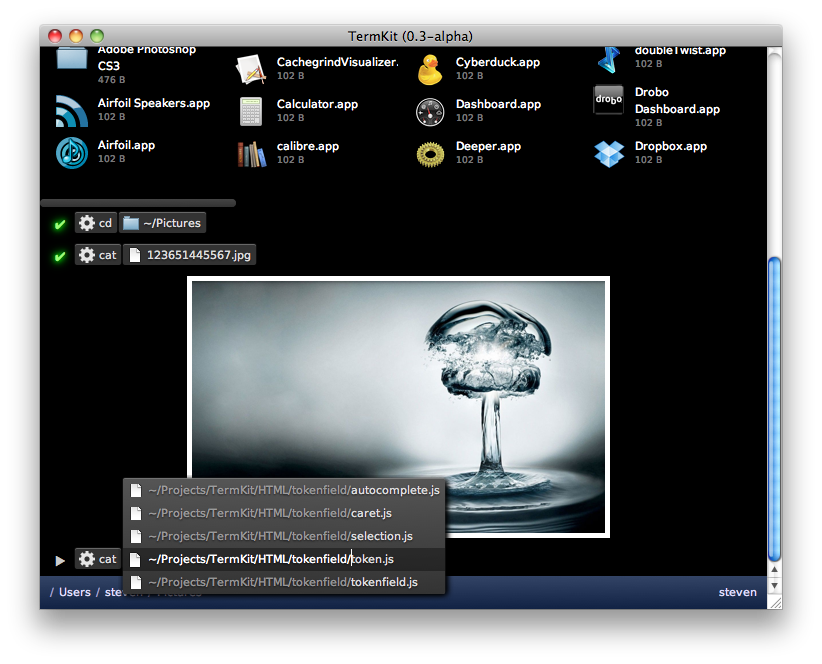

#CHECKLIST

- [ ] Usos possíveis do programa
- [ ] Requisitos para instalar
- [ ] Publico alvo, exemplos
- [ ] Casos de uso
- [ ] Gant
- [ ] Screenshots to prototipo
<!--
Regex:
[^(]#[A-Z]+

---

O relatório final deve ter no máximo 10.000 palavras


Loose text:

This project's scope also includes the reimplementation of commonly used commands in the command-line's native language (Javascript) to make the output a better graphical visualization of the results, and to allow the usage of said commands in any platform. Planned features also include syntax highlighting and autocomplete.

Th have been some attempts to modernize the shell I came across while researching,

It's an event driven language (i.e. handles asynchronicity through events and callbacks)
-->

<!-- toc orderedList:0 -->

- [Project Statement](#project-statement)
- [Research](#research)
	- [Background Research](#background-research)
	- [Alternative Existing Solutions to Your Problem](#alternative-existing-solutions-to-your-problem)
		- [Bash](#bash)
		- [ZShell](#zshell)
		- [PowerShell](#powershell)
		- [Fish Shell](#fish-shell)
		- [Termkit](#termkit)
		- [Blackscreen](#blackscreen)
	- [Technologies Researched](#technologies-researched)
		- [JavaScript](#javascript)
		- [NodeJS](#nodejs)
		- [SweetJS](#sweetjs)
		- [Electron](#electron)
		- [Mocha](#mocha)
		- [HighlandJS](#highlandjs)
		- [AngularJS](#angularjs)
	- [Other Relevant Research Done](#other-relevant-research-done)
	- [Resultant Findings and Requirements](#resultant-findings-and-requirements)
	- [Bibliography](#bibliography)
- [Description of Solution](#description-of-solution)
- [Approach and Development](#approach-and-development)
- [Design](#design)
	- [Technical Architecture Diagram](#technical-architecture-diagram)
	- [Other Design Documents](#other-design-documents)
- [Prototyping and Development](#prototyping-and-development)
- [Testing](#testing)
- [Issues and Risks](#issues-and-risks)
- [Plan and Future Work](#plan-and-future-work)
- [Conclusion](#conclusion)

<!-- tocstop -->


# Project Statement

For many years the concept of a command-line has not really changed, and has stayed not only intimidating for new users but also very limited in the way it can display information. This was fine when the totality of the interaction with the system was through the terminal but no longer makes sense given the current graphical capabilities of computers.

The goal of this project is to make possible new forms of interaction by creating a programmable, user-friendly command-line capable of working in multiple platforms, able to display images and documents in an easy to understand manner with a commands history and autocomplete.

Adding programmability in the form of an extended version of the JavaScript syntax and toolkit to include different methods for calling functions, pipes and redirections, and allowing usage of internal system commands and commands specific to this command-line interchangeably.


# Research
<!--
What research has been done and what are the outputs?, This concerns background research on the topic itself, as well as any research on the data analytics that you plan to perform and the technologies that you wish to use. Use the following headlines to fill in your information.
-->

## Background Research
<!-- Porquê do projeto -->

While researching for this topic I started by searching for similar projects, I came across several projects but none was exactly what I had in mind.

After this I did research into technologies that could be used for such a project. This lead me to decide upon the programming language and a framework and several libraries that would be good for this project.

#REVIEW
<!--

What is the difference between a series and parallel circuit?
When does a plant grow the most, during the day or night?
Where is the focal point of a lens?
How does a java applet work?
Does a truss make a bridge stronger?
Why are moths attracted to light?
Which cleaning products kill the most bacteria?

keywords: terminal,
-->


## Alternative Existing Solutions to Your Problem

### Bash

The Bash Shell (or Bourne Again Shell) is the default shell for all Unix systems. It allows both for the execution of single commands and the construction of scripts and it has a command history and no graphical capabilities other than syntax colouring.

``` bash
echo Hello World
```
*Single command*

``` bash
while [  $COUNTER -lt 10 ]; do
	echo The counter is $COUNTER
	let COUNTER=COUNTER+1
done
```
*While loop*

This shell is the baseline for any modern shell language.

### ZShell

The ZShell is an alternative to Bash, that will extending upon the syntax of Bash it adds an extremely configurable history and highlighting. Code for this language is for the most part interchangeable with bash.


### PowerShell

PowerShell is a shell language with the #TODO

``` powershell
Write-Host Hello World
```
*Single Command*

``` powershell
while($val -lt 10) {
	Write-Host The counter is $val
	$val++
}
```
*While loop*

### Fish Shell

The Fish Shell is a shell language that adds an advanced autocomplete, history and highlighting. It uses a language with similarities with python for its automation.

``` fish
echo Hello World
```
*Single Command*

``` fish
while $COUNTER > 10;
	echo The counter is $COUNTER
	set COUNTER COUNTER+1
end
```
*While loop*

Its highlighting displays in grey a guess of what comes after given the command history, making often used commands every quick to use.


### Termkit

The idea for this project came from the now defunct project TermKit. It had as objective to create a graphical, user friendly interface for the traditional Unix command-line as well as expanding the capabilities of some of the commands. This project came to a halt when it’s creator hit a blocker with WebKit, the engine he was using.

This project focused on getting an environment for the commands and as such did not implement a programming language or any scripting capabilities. It also was not capable of rendering interactive commands.


*TermKit example*

[#SOURCE of Image](https://github.com/unconed/TermKit/raw/master/Mockups/Shot-0.3.png)

### Blackscreen

While researching I discovered a project similar to what I intended #TODO

## Technologies Researched

### JavaScript

For the shell language I decided to use JavaScript since there is already a lot of projects that would help me extend its syntax and its functional and loosely typed nature is well suited to use as a shell language.

It is possible to extend the JavaScript syntax by extending or adding on to a library to break the code down into a standard format syntax tree and using another library to convert the syntax tree back into code. This might add some overhead on the code execution but it is faster than creating a language from scratch and allows for quick changes to the syntax.

### NodeJS

A server-side implementation of JavaScript built using Google's V8 engine which is the JavaScript engine for the Chrome Browser. NodeJS is used several by companies and projects and its package manager NPM is a standard in web development.

I think it is ideal for my project because it has good APIs for connecting to the operating system, is compatible with multiple operating system and allows the creation of programmable, self contained interpreters for it's self. Using this language no extra work is necessary to sandbox the interpreter. [#Reference - VM Sandbox](https://nodejs.org/api/vm.html)

### SweetJS

SweetJS is a NodeJS library that allows for the creation of scripts to extend the JavaScript syntax taking care of the breakdown and regeneration of the code. By having this in a single API makes it the simplest solution I came across for the problem of customising JavaScript.

It's worth noting that SweetJS has undergone a complete rewrite recently so, at lest initially, I will use the older version of it as features like the persistent loading of syntax scripts and syntax for adding operators have yet to be readded and are needed for the project. #REVIEW

### Electron


### Mocha

Mocha is a simple and fast testing framework for NodeJS, that allows for unit and integration testing.#TODO

### HighlandJS

### AngularJS

## Other Relevant Research Done


## Resultant Findings and Requirements

As a result of my research I have come to decide on the technologies to use on this project #TODO

## Bibliography

# Description of Solution

# Approach and Development

# Design

## Technical Architecture Diagram

## Other Design Documents
<!-- usecase, sequence -->
# Prototyping and Development

# Testing

# Issues and Risks

# Plan and Future Work

# Conclusion
